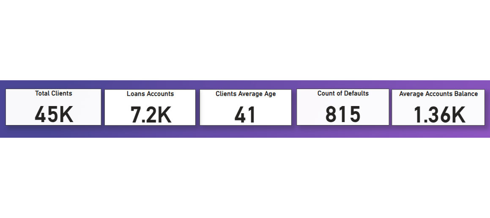

# Banking-Clients-Dataset-Analysis
## Introduction
This task is to demonstrate analysis of the Northwind traders dataset using Microsoft Power BI for practicing purposes, the analysis requirements are to develop questions, dashboards and DAX formulas.
## Problem Statement
1.	What is the total number of clients?
2.	What is the total number of loan accounts?
3.	What is the client's average age?
4.	What is the total number of default accounts?
5.	What is the average account balance?

## DATA TRANSFORMATION & CLEANING
The data was cleaned and filtered to make it easier to analyze. This included formatting the text and number types to ensure the data would not return errors.
## Analysis & Visualisation
1.	What is the total number of clients? 45,000
2.	What is the total number of loan accounts? 7,200 
3.	What is the client's average age? 41
4.	What is the total number of default accounts? 815
5.	What is the average account balance? 1,360

