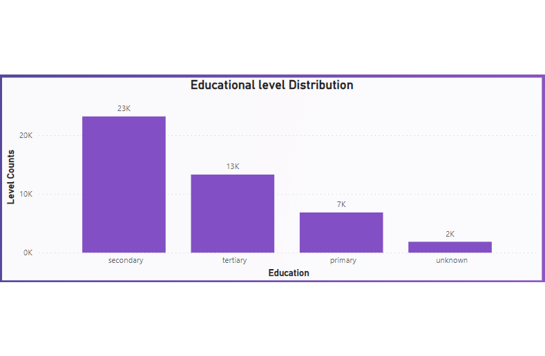
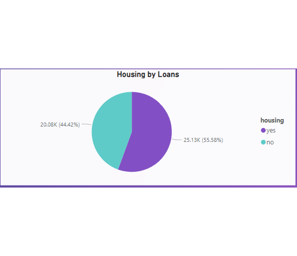

# Banking-Clients-Dataset-Analysis
## Introduction
This task is to demonstrate analysis of the Northwind traders dataset using Microsoft Power BI for practicing purposes, the analysis requirements are to develop questions, dashboards and DAX formulas.
## Problem Statement
1.	What is the total number of clients?
2.	What is the total number of loan accounts?
3.	What is the client's average age?
4.	What is the total number of default accounts?
5.	What is the average account balance?
6.	What are the client's educational level distributions?
7.	What is the client’s material status?
8.	What is the percentage of clients with housing loans?
9.	What are the methods to contact with clients?

## DATA TRANSFORMATION & CLEANING
The data was cleaned and filtered to make it easier to analyze. This included formatting the text and number types to ensure the data would not return errors.
## Analysis & Visualisation
1.	What is the total number of clients? 45,000
2.	What is the total number of loan accounts? 7,200 
3.	What is the client's average age? 41
4.	What is the total number of default accounts? 815
5.	What is the average account balance? 1,360

## What are the client's educational level distributions?
The educational level distribution in the graph shows that the majority of people have a secondary education, followed by tertiary education and primary education. The number of people with an unknown education level is very small.

## What is the client’s material status?
The pie chart shows the percentage of clients who are married, divorced, and single. The majority of clients are married (62.19%), followed by single clients (28.29%) and divorced clients (11.52%).

## What is the percentage of clients with housing loans?
The pie chart shows the percentage of people who have taken a loan to buy a house. The majority of people (55%) have taken a loan to buy a house, while the remaining 44% have not.

## What are the methods to contact with clients?
The bar chart compares the number of contacts with clients through different channels. 

